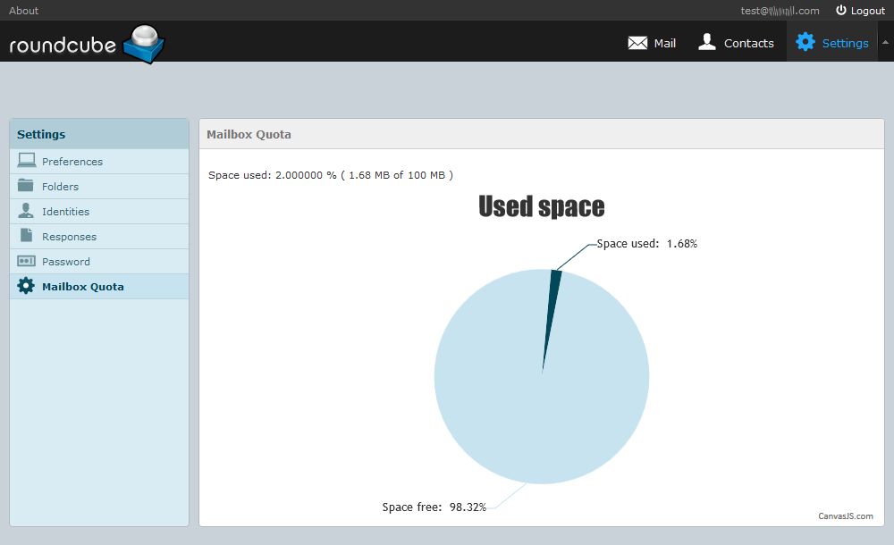

# QUOTA PLUGIN FOR ROUNDCUBE

## What is Quota plugin ?

Quota plugin is used in [Roundcube](https://roundcube.net/) to show
*used space* and *free space* for given mailbox.


## How to install this plugin in Rouncube ?

1. Create folder 'quota' in ROUNDCUBE_HOME/plugins
2. Copy all plugin files there
3. Edit ROUNDCUBE_HOME/conf/config.inc.php; locate $config['plugins'] and add 'quota' there:
> $config['plugins'] = array(
> 'archive',
> 'download',
> ... ,
> 'quota' <-- add this
> );

## How to set mailbox quota in Dovecot ?
```bash

sudo nano /etc/dovecot/conf.d/90-quota.conf

	plugin {
		quota = maildir:User quota
		quota_rule = *storage=900M
		quota_rule2 = Trash:storage=+100M
		...
	}
	
sudo service dovecot restart

```

## How to set mailbox quota in Postfix ?


:octocat: Victor Kirov
